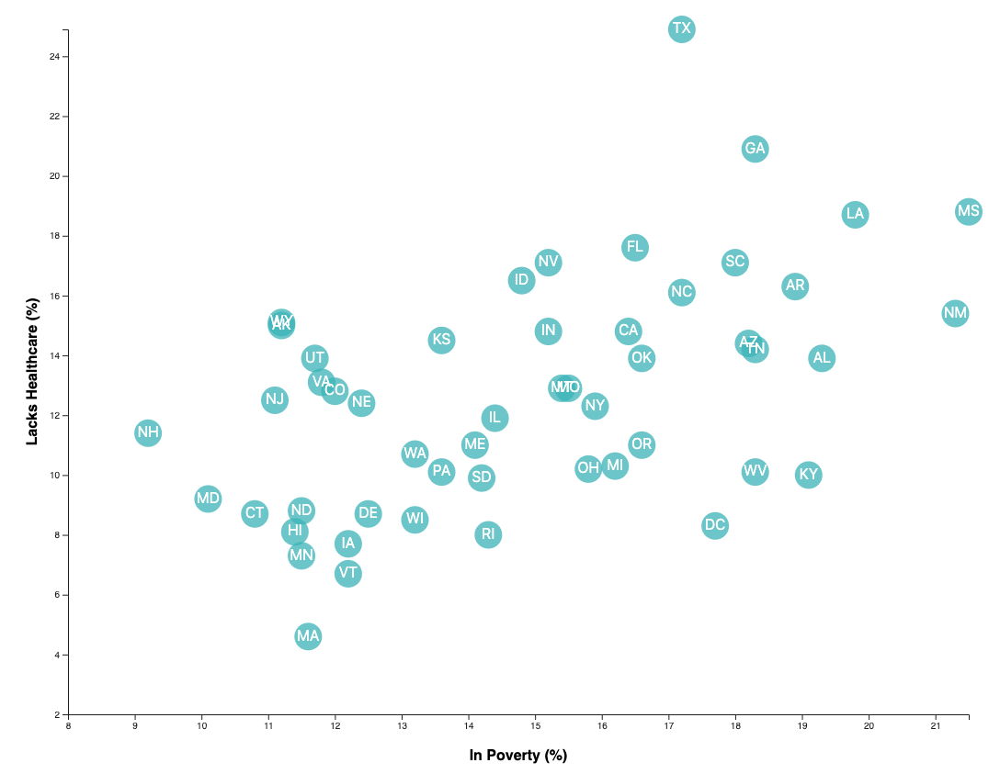

# D3-challenge
This challenge analyzes data from from the U.S. Census Bureau and the Behavioral Risk Factor Surveillance System. Charts, graphs, and interactive elements are created using D3 to present findings.

The index.html file contains the html code. The JS, CSS code as well as the data is stored in the assets folder. 

The final product is shown below. 

